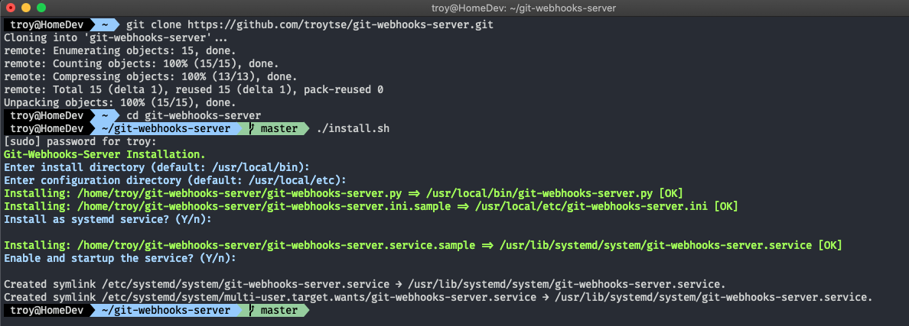
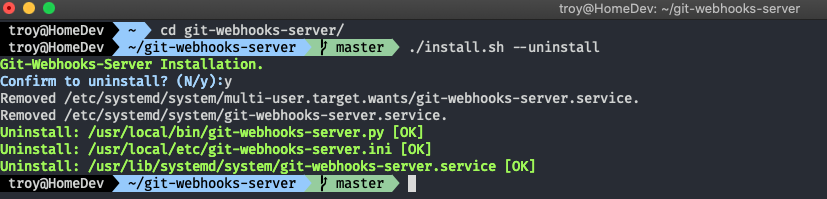
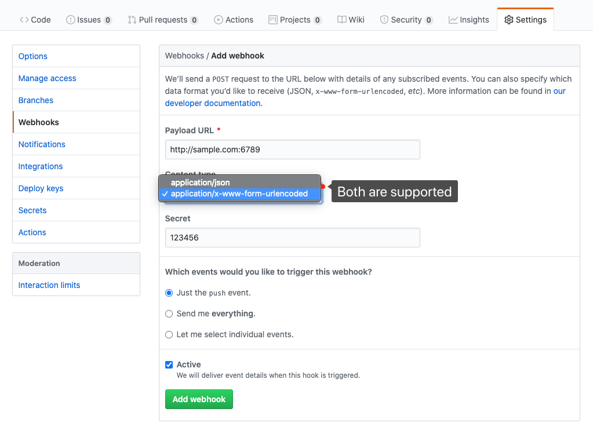
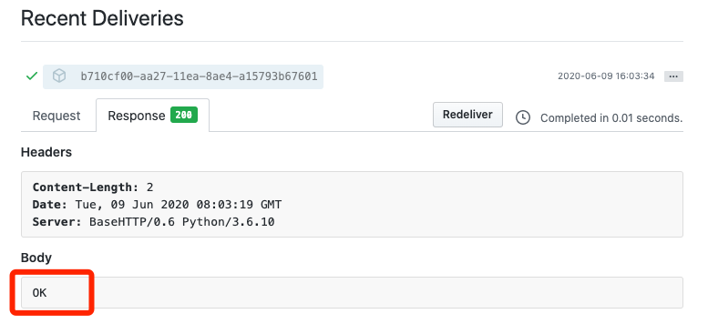
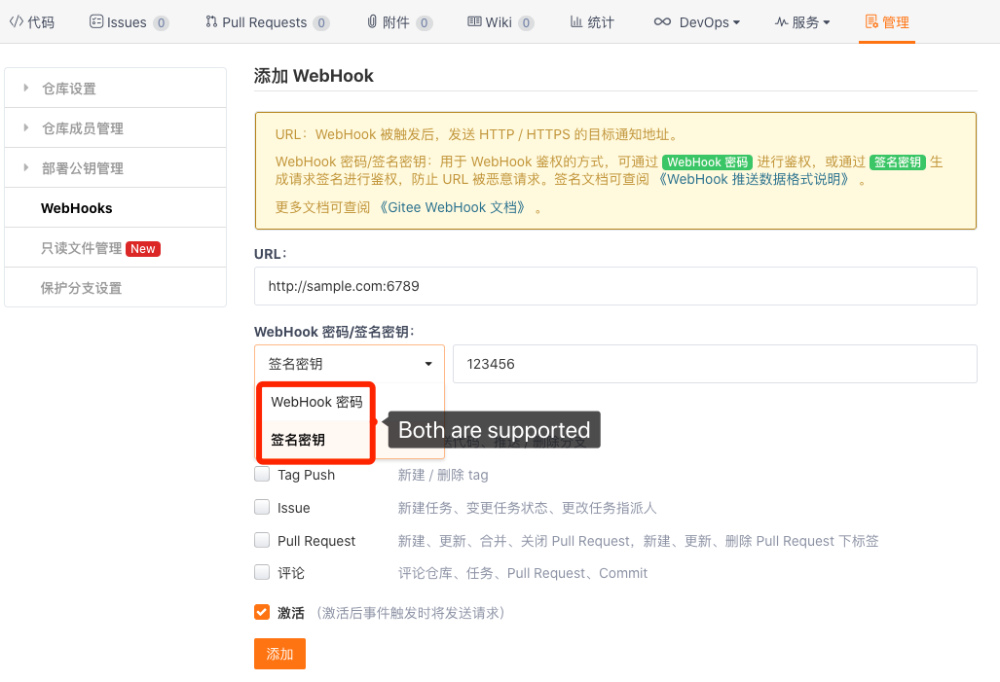
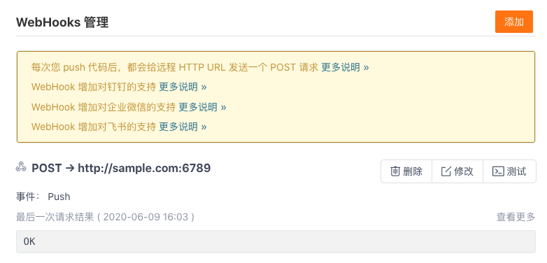
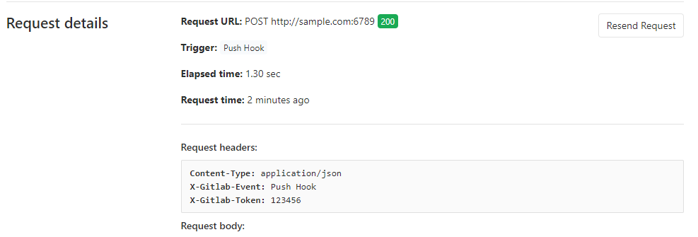

# The Git WebHooks Server

[README](README.md) | [中文说明](README.zh.md)

#### Introduction
- This git webhooks server is implemented with Python 3.
- Supports Github, Gitee, Gitlab, and custom repositories.
- Support custom working directory and command for different repositories.
- Support to install as the Systemd service.

#### Installation

- Clone or download this repository to any directory.
- Run `./install.sh` to install.
```shell
git clone https://github.com/troytse/git-webhooks-server.git
cd git-webhooks-server
./install.sh
```


#### Uninstallation

```shell
cd git-webhooks-server
./install.sh --uninstal
```


#### Usage

- Add the following settings to your configuration file:
```ini
# match the full name of your repository
[your_name/repository]
# working directory
cwd=/path/to/your/repository
# the command executes on received the notification.
cmd=git fetch --all & git reset --hard origin/master & git pull
```

- Restart the service
```shell
systemctl restart git-webhooks-server
```

- Add webhook in the repository settings.
  - Github:

  
  

  - Gitee:

  
  

  - Gitlab:

  
  

  - Custom: **TODO**

#### Configuration

- Default configuration file: `/usr/local/etc/git-webhooks-server.ini`.
- You can modify it after the installation.

```ini
[server]
address=0.0.0.0
port=6789
log_file=/var/log/git-webhooks-server.log

[github]
verify=True
secret=123456

[gitee]
verify=True
secret=123456

[gitlab]
verify=True
secret=123456

[custom]
header_name=User-Agent
header_value=Custom-Git-Hookshot
name_path=project.path_with_namespace
verify=True
secret=123456

[your_name/repository]
cwd=/path/to/your/repository
cmd=git fetch --all & git reset --hard origin/master & git pull

[your_name/sample]
cwd=/path/to/sample
cmd=git fetch --all & git reset --hard origin/master & git pull
```
