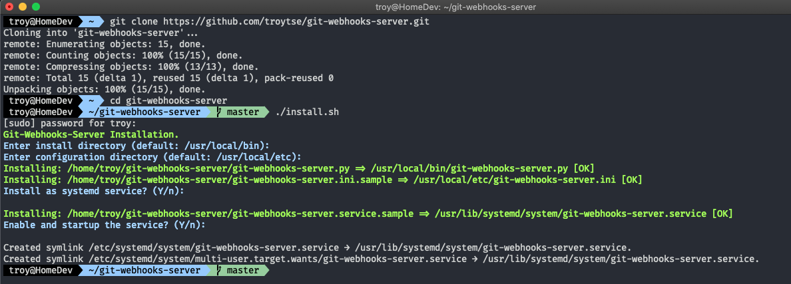
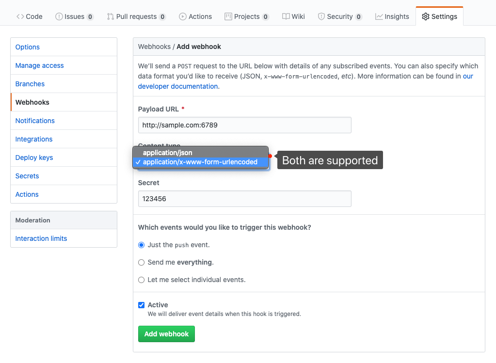
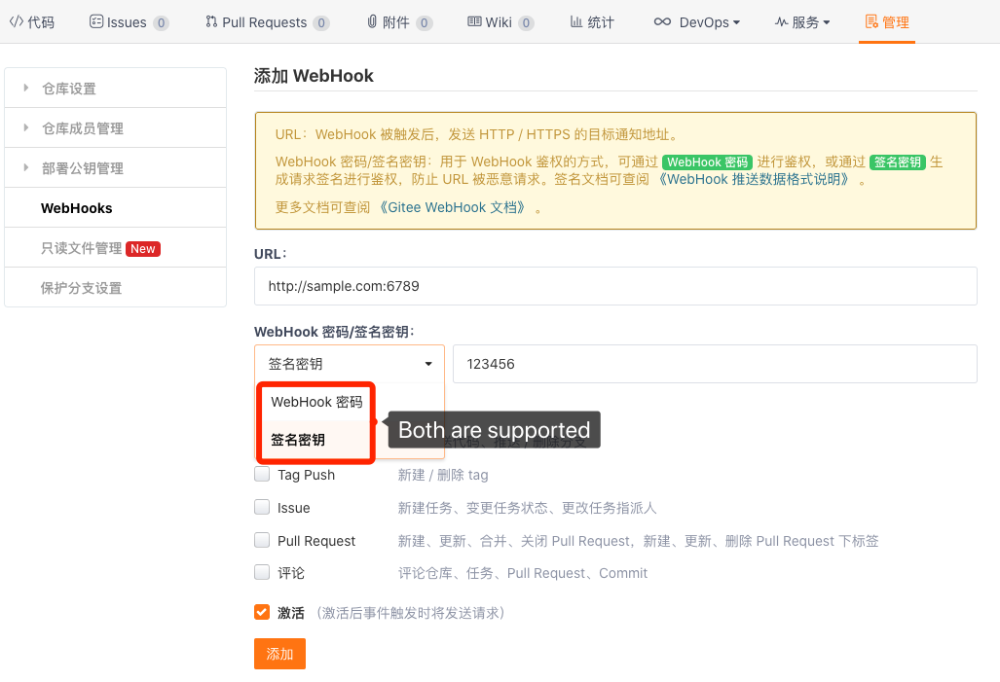

# Git WebHooks 服务

[README](README.md) | [中文说明](README.zh.md)

#### 简介
- 使用 Python 3 实现的 git webhooks 服务.
- 支持 Github、Gitee、Gitlab 及自定义仓库.
- 支持为不同的仓库指定工作目录和命令.
- 支持安装为 Systemd 服务.

#### 安装

- 克隆到任意目录.
- 执行 `./install.sh` 进行安装.
```shell
git clone https://github.com/troytse/git-webhooks-server.git
cd git-webhooks-server
./install.sh
```


#### 卸载

```shell
cd git-webhooks-server
./install.sh --uninstal
```


#### 使用

- 在配置文件中添加仓库信息:
```ini
# 匹配你的仓库全名
[your_name/repository]
# 工作目录
cwd=/path/to/your/repository
# 收到推送后执行的命令
cmd=git fetch --all & git reset --hard origin/master & git pull
```

- 重新启动服务
```shell
systemctl restart git-webhooks-server
```

- 在你的仓库设置中添加 webhook:
  - **Github**:

  
  

  - **Gitee**:

  
  

  - **Gitlab**:

  
  

  - **Custom**: 

  
  

  - **自定义**: 
  - 对于自定义 webhooks 来源, 你需要像下面这样调整你的配置文件:
  ```ini
  [custom]
  # 用于识别来源
  header_name=X-Custom-Header
  header_value=Custom-Git-Hookshot
  # 用于匹配 secret 的 header
  header_token=X-Custom-Token
  # 仓库名称在JSON请求数据中的位置
  name_path=project.path_with_namespace
  # 仅支持文本Token的认证
  verify=True
  secret=123456
  ```
  - 处理器接受 `application/json` 或 `application/x-www-form-urlencoded` 格式的请求 (你可以参考 [Github](https://developer.github.com/webhooks/event-payloads/#example-delivery) / [Gitee](https://gitee.com/help/articles/4186) / [Gitlab](https://gitlab.com/help/user/project/integrations/webhooks#push-events) 中关于请求的指引), 数据格式像这样:
  ```json
  {
  //...
    "project": {
      "path_with_namespace": "your_name/repository"
      //...
    }
  //...
  }
  ```
  
  
  

#### 配置

- 默认配置文件位置: `/usr/local/etc/git-webhooks-server.ini`.
- 你可以在安装后修改它.
- 一个典型的配置文件如下:

```ini
[server]
address=0.0.0.0
port=6789
log_file=/var/log/git-webhooks-server.log

[github]
verify=True
secret=123456

[gitee]
verify=True
secret=123456

[gitlab]
verify=True
secret=123456

[custom]
header_name=X-Custom-Header
header_value=Custom-Git-Hookshot
header_token=X-Custom-Token
name_path=project.path_with_namespace
verify=True
secret=123456

[your_name/repository]
cwd=/path/to/your/repository
cmd=git fetch --all & git reset --hard origin/master & git pull

[your_name/sample]
cwd=/path/to/sample
cmd=git fetch --all & git reset --hard origin/master & git pull
```
